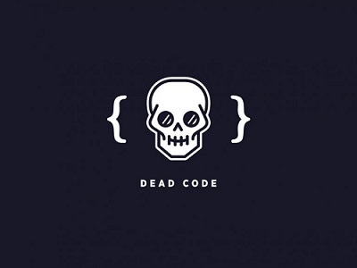

# ¿Que son los antipatrones de diseño? :interrobang: :ghost:

Si aplicamos una **analogía social**, podríamos decir que si a tú, amigo lector, no caes en el anti-patrón (nombrémosle estereotipos) de **criminal**, **terrorista**, **pervertido**, **drogadicto**, **brujo**, **dictador**, y similares, entonces podríamos afirmar que no eres una mala persona. Lo cual no implica, que seas buena; para serlo deberías, no sólo no encajar en los anti-patrones mencionados, sino además, cumplir con uno o más patrones (llamémosle cualidades): **honesto**, **trabajador**, **buen hijo y/o buen padre**, etcétera.

Los anti-patrones en arquitectura de software, son similares a sus análogos sociales, soluciones negativas, acciones que presentan mayores problemas que soluciones. Sin embargo, representan un camino fácil y rápido. Pero continuando con la analogía, podríamos pensar que si necesitas dinero, tienes dos opciones: el patrón (buen comportamiento) trabajar arduamente o el anti-patrón (rápido y con consecuencias a largo plazo) robar un banco.

En la elaboración de un sistema, intervienen al menos, diversos actores: arquitectos de software, administradores de proyecto y desarrolladores. Para cada uno de ellos, existen anti-patrones que describen comportamientos y soluciones incorrectas Los anti-patrones (una vez conocidos) constituyen para cada uno de los actores involucrados, descripciones de problemas recurrentes en la construcción de software, les proporcionan un vocabulario común para identificar problemas y discutir posibles soluciones y les sugieren pasos para la re-ingeniería, y re-organización estructural de un sistema.

### Consideramos 3 tipos de antipatrones: 
- Antipatrones de codificación.
- Antipatrones de arquitectura.
- Anti-patrones de Administración de Proyecto

Vamos a ver algunos patrones de la primera clasificación:
## 1.  Spaghetti Code :spaghetti:
Bien, muy posiblemente nos podremos haber encontrado con código spaghetti y nunca nos dimos cuenta, personalmente, si me lo he encontrado y no tenia ni idea de que lo pudiera clasificar de esa forma. Para lograr entenderlo imaginemos un plato de spaghetti... está todo revuelto, ¿verdad? y muy posiblemente el plato este sucio, sucio por la salsa, de pronto por la grasa, si este tiene albóndigas también, en fin... nos encontramos con tremendo lio, además, tratemos de separarlo y entenderlo, con esto ultimo me refiero a deducir de donde viene cada spaguetti, con quien se relaciona. Espero mediante esta análogia ya te este imaginando a que se refiere el código spaghetti.

Bien, el código spagghetti se caracteriza por que, es eso... un plato de spaghetti, es decir, podemos encontrarnos en un mismo archivo, diferente lenguajes juntos, clases mal organizadas, rompiendo principios de diseño de forma absurda, en fin, ni siquiera el código spaghetti lo podemos considerar una mala practica de programación, por que muchos programadores afirman que es peor que esto. Por ejemplo, nos encontramos con un diseño de una pagina web, y al analizar su codigo nos damos cuenta de que el programador situó tanto sentencias sql, como estilos, sentencias de javascript y html, todo en un mismo archivo jsp por ejemplo, todo esto obedece a clasificarse como codigo spaghetti.

No es solo esto, además el código se vuelve difícil de mantener, ya que, en primer lugar puede costar entenderlo y en segundo lugar, todo esta tan acoplado que un mínimo cambio dañaría por completo el software.

Algo así como la siguiente imagen:

### 1.1 ¿Como podemos evitar esto?

Principalmente, realizando un buen diseño de software desde el principio, una buena técnica para evitar este tipo de código es usar patrones y principios de diseño, haciendo un software con una alta cohesión, es decir que cada modulo tenga mucha relación con sus funcionalidades y mantenga una sola responsabilidad y por otro lado que este código tenga un acoplamiento bajo, es decir que la relación que exista entre sus módulos no sea mucha, esto para evitar muchas dependencias en el código.

## 2. Codigo Muerto :skull:

En programación existe lo que es el código fuente (conjunto de líneas de texto con los pasos que debe seguir la computadora para ejecutar dicho programa). Por otra parte el código muerto es una parte del código fuente que se ejecuta, cuyos resultados nunca se usan. Este tipo de código consume tiempo de cómputo en algo que jamás se utiliza.

El código muerto no puede ser confundido en el código inalcanzable (este jamás se ejecuta, y si bien los dos son indeseables el código muerto es más grave que el inalcanzable).

Además de consumir tiempo de computo el código muerto puede arrojar excepciones o afectar un estado global del programa. Por lo tanto si bien los resultados jamás se utilizan remover este código puede cambiar la salida del programa y evitar bugs innecesarios. Esta es una razón por la cual el código muerto es menos deseado que el código inalcanzable.

### ¿Por qué es importante eliminar codigo muerto?

Las principales importancias de eliminar código muerto es que ahorra tiempo de cómputo innecesario, evita accesos a memoria innecesarios y ejecutar código que no se utilice ya que puede arrojar excepciones.

### 2.2 ¿Como se puede eliminar este codigo muerto?

En los proyectos de programación grandes, a veces es difícil de reconocer y eliminar código muerto, especialmente cuando algún módulo entero quede muerto.

Algunos entorno de desarrollo integrado o interactivo (como Visual Studio 2010 y Eclipse) poseen la habilidad de detectar código muerto durante tiempo de compilación.
## 3. Clases Poltergeist (Fantasmas):ghost:
Se caracteriza por tener varias clases en el sistema o tablas en la base de datos con pocas responsabilidades. Este anti-patrón suele darse cuando un modelo de análisis y/o diseño es inestable: el diseño no suele coincidir con la implementación y ampliar el sistema es poco probable, dado que habiendo tanto “fantasma”, encontrar los elementos relevantes es imposible. Diciendolo coloquialmente seria encontrar una aguja (codigo versatil y de facil ampliación) en un pajar (codigo inutil)

### 3.1 ¿Por qué es importante no tener clases fantasmas?
 Piensalo asi: En una pelicula de terror cuando hay un espiritu en la casa nada funciona como deberia ¿verdad?, lo mismo sucede cuando tenemos clases fantasma tal vez las cosas funcionen por un tiempo pero eventualmente empezaran a fallar
 
